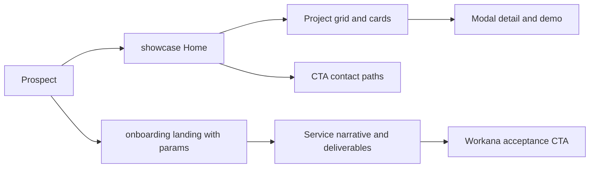

# Architecture Map - Ad Astra Content Surfaces

## Scope audited
- Project A (showcase): ../client-showcase-overview
- Project B (onboarding): presentation-hub
- Goal: map real user-facing messaging surfaces, ownership, rendering source, and active variants.

## Fase 0 - Repo orientation (verified)

### Exact framework stack per project
- showcase.ad-astra.me: React 18.3.1 + Vite 5 + TypeScript + Tailwind 3 + Radix/shadcn, verified in [../client-showcase-overview/package.json](../client-showcase-overview/package.json#L1). [IMPLEMENTADO] CONFIDENCE: HIGH
- onboarding.ad-astra.me: Astro 6.3.6 + React 19 islands + TypeScript + Tailwind 4, verified in [package.json](package.json#L1). [IMPLEMENTADO] CONFIDENCE: HIGH

### Where each content type lives
- Showcase catalog data loader and normalization: [../client-showcase-overview/src/data/templates.tsx](../client-showcase-overview/src/data/templates.tsx#L1). [IMPLEMENTADO] CONFIDENCE: HIGH
- Showcase taxonomy/commercial names: [../client-showcase-overview/src/data/industry-config.ts](../client-showcase-overview/src/data/industry-config.ts#L1). [IMPLEMENTADO] CONFIDENCE: HIGH
- Showcase marketing copy hardcoded in components: [../client-showcase-overview/src/components/HowItWorks.tsx](../client-showcase-overview/src/components/HowItWorks.tsx#L1), [../client-showcase-overview/src/components/UseCases.tsx](../client-showcase-overview/src/components/UseCases.tsx#L1), [../client-showcase-overview/src/components/WhyChooseUs.tsx](../client-showcase-overview/src/components/WhyChooseUs.tsx#L1), [../client-showcase-overview/src/components/FAQ.tsx](../client-showcase-overview/src/components/FAQ.tsx#L1), [../client-showcase-overview/src/components/FloatingCTA.tsx](../client-showcase-overview/src/components/FloatingCTA.tsx#L1), [../client-showcase-overview/src/components/Footer.tsx](../client-showcase-overview/src/components/Footer.tsx#L1), [../client-showcase-overview/src/components/Navbar.tsx](../client-showcase-overview/src/components/Navbar.tsx#L1). [IMPLEMENTADO] CONFIDENCE: HIGH
- Onboarding declared data source: [src/data/deliverables.ts](src/data/deliverables.ts#L1), [src/data/faq.ts](src/data/faq.ts#L1), [src/data/process.ts](src/data/process.ts#L1). [IMPLEMENTADO] CONFIDENCE: HIGH
- Onboarding service-level messaging in config (not src/data): [src/config/services.ts](src/config/services.ts#L1). [IMPLEMENTADO] CONFIDENCE: HIGH
- Onboarding additional hardcoded messaging in islands (not src/data): [src/components/react/HeroSection.tsx](src/components/react/HeroSection.tsx#L14), [src/components/react/CTASection.tsx](src/components/react/CTASection.tsx#L39), [src/components/react/CommunicationBentoSection.tsx](src/components/react/CommunicationBentoSection.tsx#L150). [IMPLEMENTADO] CONFIDENCE: HIGH

### Files controlling content variants
- Showcase workana mode toggle: [../client-showcase-overview/src/pages/Index.tsx](../client-showcase-overview/src/pages/Index.tsx#L77).
- Showcase workana effects:
- Hero button text/scroll target: [../client-showcase-overview/src/pages/Index.tsx](../client-showcase-overview/src/pages/Index.tsx#L277)
- Footer safe mode: [../client-showcase-overview/src/pages/Index.tsx](../client-showcase-overview/src/pages/Index.tsx#L472) and [../client-showcase-overview/src/components/Footer.tsx](../client-showcase-overview/src/components/Footer.tsx#L30)
- Floating CTA hidden: [../client-showcase-overview/src/pages/Index.tsx](../client-showcase-overview/src/pages/Index.tsx#L476)
- Modal safe mode passed: [../client-showcase-overview/src/pages/Index.tsx](../client-showcase-overview/src/pages/Index.tsx#L483)
- Onboarding params parser/defaults: [src/lib/params.ts](src/lib/params.ts#L20)
- Onboarding service variant binding: [src/pages/index.astro](src/pages/index.astro#L16)
- Onboarding platform workana behavior in hero: [src/components/react/HeroSection.tsx](src/components/react/HeroSection.tsx#L22)
- Onboarding platform workana behavior in final CTA: [src/components/react/CTASection.tsx](src/components/react/CTASection.tsx#L17)
- Onboarding lang usage (html lang only): [src/layouts/BaseLayout.astro](src/layouts/BaseLayout.astro#L17)

### Validation: is onboarding src/data the real source of truth?
- Result: PARTIAL / NOT SINGLE SOURCE.
- Reason: core copy also lives in src/config/services.ts and multiple React islands, so src/data is not the only source of messaging truth.
- Evidence: [src/config/services.ts](src/config/services.ts#L12), [src/components/react/HeroSection.tsx](src/components/react/HeroSection.tsx#L14), [src/components/react/CTASection.tsx](src/components/react/CTASection.tsx#L40).
- Classification: [INFERIDO] risk of desynchronization is confirmed by code layout. CONFIDENCE: HIGH

## Prospect flow (real)

- There is no direct in-code CTA bridge from showcase to onboarding URL in audited components.
- Showcase CTA paths point to WhatsApp/Calendly/ad-astra.me and demo URLs.
- Onboarding primary conversion path points to Workana CTA URL.
- Classification: [IMPLEMENTADO] for each local path, [INFERIDO] for cross-site bridge gap. CONFIDENCE: MEDIUM

## Surface map - showcase.ad-astra.me

| Surface | Render file/component | Content source | Audience | Primary CTA | Secondary CTA | Variant behavior | Status |
|---|---|---|---|---|---|---|---|
| Home / Hero | [../client-showcase-overview/src/pages/Index.tsx](../client-showcase-overview/src/pages/Index.tsx#L227) | Hardcoded copy + mode param | Top-of-funnel prospects | Ver Soluciones | Agendar Reunion / Ver Proyectos | mode=workana changes CTA text and scroll target | [IMPLEMENTADO] CONFIDENCE: HIGH |
| Marketing HowItWorks | [../client-showcase-overview/src/components/HowItWorks.tsx](../client-showcase-overview/src/components/HowItWorks.tsx#L1) | Hardcoded | Discovery prospects | Implicit progression to contact | None explicit | None | [IMPLEMENTADO] CONFIDENCE: HIGH |
| Marketing UseCases | [../client-showcase-overview/src/components/UseCases.tsx](../client-showcase-overview/src/components/UseCases.tsx#L1) | Hardcoded case narratives | Consideration-stage prospects | Implicit consult CTA copy | None linkified | None | [IMPLEMENTADO] CONFIDENCE: HIGH |
| Marketing WhyChooseUs | [../client-showcase-overview/src/components/WhyChooseUs.tsx](../client-showcase-overview/src/components/WhyChooseUs.tsx#L1) | Hardcoded | Consideration-stage prospects | None explicit | None | None | [IMPLEMENTADO] CONFIDENCE: HIGH |
| FAQ | [../client-showcase-overview/src/components/FAQ.tsx](../client-showcase-overview/src/components/FAQ.tsx#L1) | Hardcoded Q/A | Late consideration | None explicit | None | One FAQ item commented out | [IMPLEMENTADO] + [DEAD] CONFIDENCE: HIGH |
| Project grid + filters | [../client-showcase-overview/src/pages/Index.tsx](../client-showcase-overview/src/pages/Index.tsx#L344) | templates.tsx + JSON catalog | Prospects comparing solutions | Open card modal / demo | Filter tabs all/saas/landing/portfolio | No mode-specific filtering | [IMPLEMENTADO] CONFIDENCE: HIGH |
| CardTemplate | [../client-showcase-overview/src/components/CardTemplate.tsx](../client-showcase-overview/src/components/CardTemplate.tsx#L1) | Template object props | Prospects evaluating fit | Ver Demo | Open modal on card click | None | [IMPLEMENTADO] CONFIDENCE: HIGH |
| ModalTemplate | [../client-showcase-overview/src/components/ModalTemplate.tsx](../client-showcase-overview/src/components/ModalTemplate.tsx#1045) | Template fields + hardcoded CTA URLs | High-intent prospects | Ver Demo | WhatsApp + Agendar Llamada | safeMode suppresses commercial CTA buttons | [IMPLEMENTADO] with mixed data/hardcode CONFIDENCE: HIGH |
| FloatingCTA | [../client-showcase-overview/src/components/FloatingCTA.tsx](../client-showcase-overview/src/components/FloatingCTA.tsx#4) | Hardcoded WhatsApp number/message | Mobile/desktop direct-contact users | WhatsApp | None | Hidden when mode=workana from page logic | [IMPLEMENTADO] CONFIDENCE: HIGH |
| Navbar | [../client-showcase-overview/src/components/Navbar.tsx](../client-showcase-overview/src/components/Navbar.tsx#34) | Entire nav/CTA is commented | All users | None (currently) | None (currently) | Commented blocks indicate dead/legacy nav model | [DEAD] [LEGACY] CONFIDENCE: HIGH |
| Footer | [../client-showcase-overview/src/components/Footer.tsx](../client-showcase-overview/src/components/Footer.tsx#15) | Hardcoded contact object + safe mode branch | Bottom-funnel prospects | Agendar Reunion Gratuita | WhatsApp, mailto, site link | safeMode removes commercial CTA block | [IMPLEMENTADO] CONFIDENCE: HIGH |
| Empty state | [../client-showcase-overview/src/pages/Index.tsx](../client-showcase-overview/src/pages/Index.tsx#407) | Hardcoded message | Users with no results | None | None | Same across modes | [IMPLEMENTADO] CONFIDENCE: HIGH |
| 404 / NotFound | [../client-showcase-overview/src/pages/NotFound.tsx](../client-showcase-overview/src/pages/NotFound.tsx#1) and route in [../client-showcase-overview/src/App.tsx](../client-showcase-overview/src/App.tsx#19) | Hardcoded | Invalid route traffic | Return to Home | None | None | [IMPLEMENTADO] CONFIDENCE: HIGH |

## Surface map - onboarding.ad-astra.me (Presentation Hub)

| Surface | Render file/component | Content source | Audience | Primary CTA | Secondary CTA | Variant behavior | Status |
|---|---|---|---|---|---|---|---|
| Entrypoint shell | [src/pages/index.astro](src/pages/index.astro#L20) + [src/layouts/BaseLayout.astro](src/layouts/BaseLayout.astro#L16) | Param-driven composition + service config metadata | Prospects with personalized proposal links | N/A (layout) | N/A | service controls block props, lang sets html lang | [IMPLEMENTADO] CONFIDENCE: HIGH |
| Hero | [src/components/react/HeroSection.tsx](src/components/react/HeroSection.tsx#19) | service config + hardcoded trust badges + params | Proposal recipients | ACEPTAR PROPUESTA / service CTA | Ver portfolio (non-workana only) | platform=workana removes anchor link and portfolio CTA; client appends personalized headline suffix | [IMPLEMENTADO] CONFIDENCE: HIGH |
| Process | [src/components/react/ProcessSection.tsx](src/components/react/ProcessSection.tsx#1) + [src/data/process.ts](src/data/process.ts#L7) | Data-driven steps (with hardcoded section header text in component) | Mid-funnel evaluators | None explicit | None | No param-specific differences | [IMPLEMENTADO] CONFIDENCE: HIGH |
| Deliverables | [src/components/react/DeliverablesSection.tsx](src/components/react/DeliverablesSection.tsx#287) + [src/data/deliverables.ts](src/data/deliverables.ts#L10) | Data-driven by service + hardcoded guarantees | Mid-funnel evaluators | None explicit | None | service changes full deliverable set | [IMPLEMENTADO] CONFIDENCE: HIGH |
| Communication | [src/components/react/CommunicationBentoSection.tsx](src/components/react/CommunicationBentoSection.tsx#150) | Hardcoded operational messaging | Trust-building stage | None explicit | None | No param-specific differences | [IMPLEMENTADO] CONFIDENCE: HIGH |
| FAQ | [src/blocks/FAQ.astro](src/blocks/FAQ.astro#L12) + [src/data/faq.ts](src/data/faq.ts#L9) | Universal + service-specific FAQ data, section title hardcoded in block | Objection-handling stage | None explicit | None | service appends service FAQ set | [IMPLEMENTADO] CONFIDENCE: HIGH |
| Final CTA | [src/components/react/CTASection.tsx](src/components/react/CTASection.tsx#14) | Hardcoded CTA body copy + service CTA label + site config URL | Conversion stage | ACEPTAR PROPUESTA / service CTA | Contact email (non-workana only) | platform=workana removes outbound link and email helper text | [IMPLEMENTADO] CONFIDENCE: HIGH |
| Portal preview section | [src/blocks/PortalPreview.astro](src/blocks/PortalPreview.astro#L1), [src/components/react/PortalSection.tsx](src/components/react/PortalSection.tsx#1) | Exists but block import/render commented out in page | High-intent users | Ver el portal | Informational note | Not rendered in current page | [DEAD] [LEGACY] CONFIDENCE: HIGH |

## Active variant coverage requested (minimum set)

### Parsing and defaults source
- service, industry, client, lang, platform parsed and defaulted in [src/lib/params.ts](src/lib/params.ts#L20). [IMPLEMENTADO] CONFIDENCE: HIGH

### Effective behavior by axis
- service axis (landing/ecommerce/bot): changes label, headline, subheadline, CTA label via [src/config/services.ts](src/config/services.ts#L12), deliverables via [src/data/deliverables.ts](src/data/deliverables.ts#L10), FAQ appended set via [src/data/faq.ts](src/data/faq.ts#L35). [IMPLEMENTADO] CONFIDENCE: HIGH
- platform axis (default/workana): modifies hero CTA rendering and secondary CTA presence in [src/components/react/HeroSection.tsx](src/components/react/HeroSection.tsx#160), and final CTA rendering in [src/components/react/CTASection.tsx](src/components/react/CTASection.tsx#48). [IMPLEMENTADO] CONFIDENCE: HIGH
- lang axis (es/en): only affects html lang attribute in [src/layouts/BaseLayout.astro](src/layouts/BaseLayout.astro#L17); no bilingual content dictionaries found in audited files. [IMPLEMENTADO] with functional limitation CONFIDENCE: HIGH
- industry axis (retail/startup/local/saas/default): accepted/normalized in [src/lib/params.ts](src/lib/params.ts#L27) but not consumed in audited rendering components for copy or structure. [IMPLEMENTADO] parser-level, [INFERIDO] no visible UI impact CONFIDENCE: MEDIUM

### Critical combinations auditability status
- /?service=landing: supported via service config mapping.
- /?service=ecommerce: supported via service config/data records.
- /?service=bot: supported via service config/data records.
- /?service=bot&platform=workana: supported, CTA behavior switches to non-link visual acceptance state.
- /?service=landing&lang=en: html lang changes, content text remains Spanish in audited components.
- /?service=bot&lang=en: same as above.
- /?service=bot&industry=saas: industry accepted but no audited content mutation.
- /?service=landing&industry=retail: industry accepted but no audited content mutation.
- Classification: [IMPLEMENTADO] for parser support, [INFERIDO] for end-user messaging impact where industry/lang are not reflected in copy. CONFIDENCE: HIGH

## Ownership and rendering source summary
- Data-fed content owners (onboarding): src/data + src/config/services.
- Hardcoded marketing owners (onboarding): multiple React islands and Astro blocks.
- Data-fed catalog owners (showcase): src/data/templates.tsx + src/data/data/projects/**/*.json + src/data/industry-config.ts.
- Hardcoded marketing owners (showcase): page and component-level copy.
- Dead/legacy content owners:
- Showcase navbar full nav system commented out: [../client-showcase-overview/src/components/Navbar.tsx](../client-showcase-overview/src/components/Navbar.tsx#42).
- Onboarding portal preview section disconnected from page composition: [src/pages/index.astro](src/pages/index.astro#L8).

## Immediate architectural risks found during mapping
- Cross-surface funnel handoff is not explicit in audited CTA destinations. [INFERIDO] CONFIDENCE: MEDIUM
- Onboarding source-of-truth is split (src/data + src/config + hardcoded islands), increasing semantic drift risk. [IMPLEMENTADO] CONFIDENCE: HIGH
- Showcase has hardcoded contact values with placeholders/comments and multiple numbers across components, creating contact drift risk. [IMPLEMENTADO] CONFIDENCE: HIGH
- lang=en currently changes document language metadata but not proposal copy language in audited components. [IMPLEMENTADO] CONFIDENCE: HIGH
